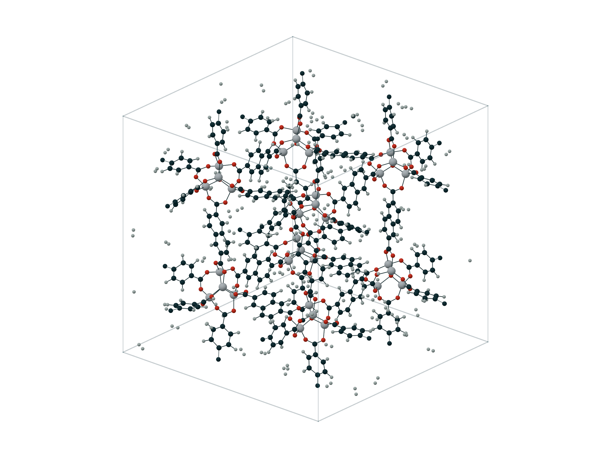

# PQViewer

PQViewer is a local molecular structure and trajectory viewer built on
[PQAnalysis](https://github.com/MolarVerse/PQAnalysis). It combines indexed
trajectory access, correct PQ-centered periodic cells, direct measurements, and
reproducible publication figures in a modern browser interface.

PQViewer is preparing for its first public beta. File and Python interfaces may
still change before 1.0.


<p align="center">
  <a href="docs/web-demo.md"><strong>Interactive web demo</strong></a>
  ·
  <a href="https://molarverse.github.io/PQViewer/"><strong>Read the documentation</strong></a>
  ·
  <a href="examples/pqviewer-notebook.ipynb"><strong>Open the Jupyter example</strong></a>
</p>

| Protein | Molecule | Framework |
|:--:|:--:|:--:|
|  |  |  |

## Quick start

PQViewer requires Python 3.12 or newer.

```bash
git clone https://github.com/MolarVerse/PQViewer.git
cd PQViewer
python3 -m venv .venv
source .venv/bin/activate
python -m pip install .
pqviewer examples/water.xyz
```

The interface is bundled with the Python package. Node.js is not required to
install or run the viewer.

The application stays on one page: **View** controls the scene, **Edit** owns
atom and cell changes, **Analyze** explains selections and measurements, and
**Export** opens the publication figure path. The central finder searches
atoms, settings, and commands using `Cmd/Ctrl+K` or `/`; on small screens,
**Tools** opens the same inspector as an expandable sheet.

## Playable web demo

The Pages-ready demo runs the same bundled 3Dmol.js interface against a
read-only SrTiO3 perovskite dataset. It supports rotation, selection,
structure and cell edits, representation controls, command search, and
client-side structure and figure export without a Python server. Opening local
files, streaming growing trajectories, and PQAnalysis calculations remain in
the installed local application.

Its target URL is
[`molarverse.github.io/PQViewer/viewer/`](https://molarverse.github.io/PQViewer/viewer/).
Publishing from the current private repository requires a GitHub plan that
supports Pages for private repositories, or making the repository public.

Open a trajectory, PQ input, run directory, or frame slice:

```bash
pqviewer trajectory.xyz
pqviewer run.in
pqviewer path/to/run-directory
pqviewer 'trajectory.xyz@100:1000:10'
```

ASE file and object support is optional:

```bash
python -m pip install '.[ase]'
pqviewer structure.cif
pqviewer optimization.traj
```

## Jupyter

Install the notebook helper, then return `view(...)` from a cell:

```bash
python -m pip install '.[jupyter,ase]'
```

```python
from pqviewer import view

viewer = view("trajectory.xyz", height=620)
viewer
```

The iframe is the real local application, not a static screenshot. Close its
server with `viewer.close()` when it is no longer needed. See the
[executable notebook](examples/pqviewer-notebook.ipynb) and
[Jupyter guide](docs/jupyter.md).

## What it does

- Opens structures, trajectories, PQ inputs, and joined restart runs.
- Uses indexed access for PQ sources, ASE `.traj`, and indexed ASE sequences
  without retaining every coordinate frame in memory.
- Displays forces, velocities, charges, periodic images, water, protein
  cartoons, and crystal coordination polygons or polyhedra when supported.
- Edits atom identity, Cartesian coordinates, lattice parameters, vectors, and
  periodic axes locally, then downloads the current frame as EXTXYZ.
- Uses PQ's centered fractional cell convention, `[-0.5, 0.5)`, including
  triclinic cells.
- Selects atoms by pointer, box, element, molecule, residue, connectivity, or
  distance.
- Measures periodic distances, angles, and dihedrals and plots them over time.
- Tracks selected atoms, bookmarks frames, compares against a reference, and
  calculates pair-distribution and coordination curves through PQAnalysis.
- Exports publication PNG and TIFF figures plus CSV, SVG, and PDF plots.
- Saves source-validated figure recipes for reproducible headless rendering.
- Keeps major viewer actions available through command search and keyboard
  shortcuts.

Try the included periodic fixtures:

```bash
pqviewer examples/periodic-boundary.extxyz
pqviewer examples/periodic-crossing.extxyz
pqviewer examples/acof-triclinic.xyz
pqviewer examples/strontium-titanate.extxyz
```

## Documentation

- [Documentation overview](docs/index.md)
- [Getting started](docs/getting-started.md)
- [Interactive web demo](docs/web-demo.md)
- [Jupyter](docs/jupyter.md)
- [Viewer guide](docs/viewer-guide.md)
- [Data sources and periodic conventions](docs/data-and-conventions.md)
- [Trajectory analysis](docs/trajectory-analysis.md)
- [Figures and recipes](docs/figures-and-recipes.md)
- [Python API](docs/python-api.md)
- [Troubleshooting](docs/troubleshooting.md)
- [Product direction](PRODUCT_DIRECTION.md)
- [Changelog](CHANGELOG.md)

## Contributing and citation

See [CONTRIBUTING.md](CONTRIBUTING.md) for the development workflow and
[SECURITY.md](SECURITY.md) for private vulnerability reports. If PQViewer
supports published work, cite it using [CITATION.cff](CITATION.cff).

PQViewer runs on the local machine and binds to `127.0.0.1` by default. It does
not provide authentication; do not expose it to an untrusted network.

PQViewer is available under the [MIT License](LICENSE). Redistributed example
data is covered in [THIRD_PARTY_NOTICES.md](THIRD_PARTY_NOTICES.md).
