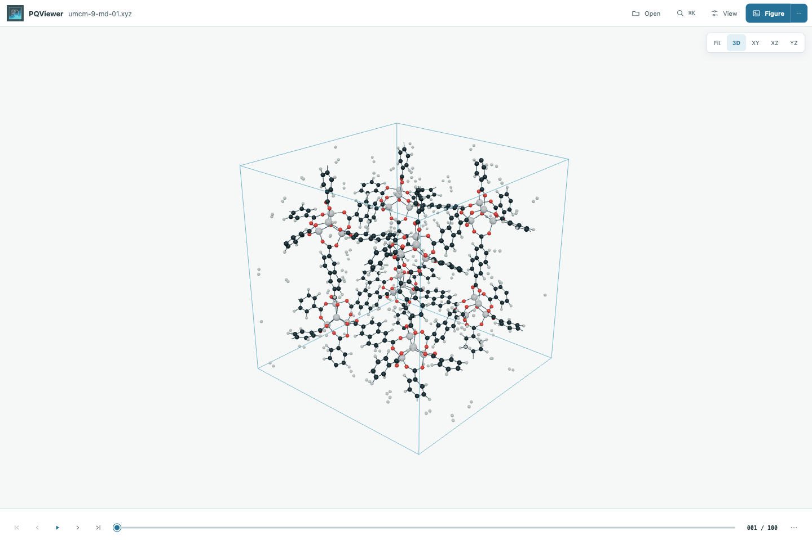

# PQViewer

PQViewer opens molecular structures and trajectories from PQ in a local
browser, with optional ASE format support. It provides indexed playback,
centred periodic cells, measurements, and reproducible figure export.

[Documentation](https://molarverse.github.io/PQViewer/) ·
[Web demo](https://molarverse.github.io/PQViewer/viewer/) ·
[Jupyter example](examples/pqviewer-notebook.ipynb)



PQViewer is preparing for its first public beta. File and Python interfaces may
change before 1.0.

## Install

PQViewer requires Python 3.12 or newer.

```bash
git clone https://github.com/MolarVerse/PQViewer.git
cd PQViewer
python3 -m venv .venv
source .venv/bin/activate
python -m pip install .
pqviewer examples/water.xyz
```

Node.js is not required. Optional ASE format support is installed with
`python -m pip install '.[ase]'`.

The CLI also accepts PQ inputs, run directories, ASE sources, and frame slices.
See [Getting started](https://molarverse.github.io/PQViewer/getting-started.html)
for examples.

## Viewer

- 3Dmol.js atoms, bonds, protein cartoons, surfaces, cells, and selections
- centred orthorhombic and triclinic cells, wrapping, and molecule reconstruction
- atom and cell editing with EXTXYZ download
- trajectory playback, measurements, analysis, forces, and collision indicators
- independent PNG and TIFF figure rendering with reusable recipes

Search atoms, settings, and commands with the central **Search** field,
`Cmd/Ctrl+K`, or `/`.

## Jupyter

```bash
python -m pip install '.[jupyter,ase]'
```

```python
from pqviewer import view

viewer = view("trajectory.xyz", height=620)
viewer
```

The notebook cell embeds the local viewer. Call `viewer.close()` when finished.
See the [Jupyter guide](https://molarverse.github.io/PQViewer/jupyter.html) for
files, ASE objects, companion data, and remote kernels.

## Project

[Contributing](CONTRIBUTING.md) · [Citation](CITATION.cff) ·
[Security](SECURITY.md) · [Changelog](CHANGELOG.md) · [License](LICENSE) ·
[Third-party notices](THIRD_PARTY_NOTICES.md)

PQViewer binds to `127.0.0.1` by default and does not provide authentication.
Do not expose the local server to an untrusted network.
