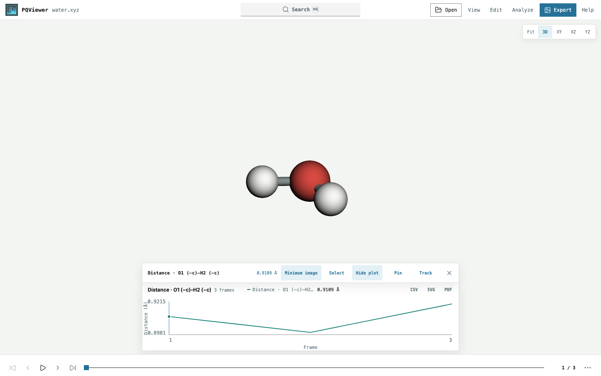

# Getting started

## Install

Use Python 3.12 or newer and a desktop browser with WebGL 2:

```bash
python3 -m venv .venv
source .venv/bin/activate
python -m pip install MolarVerse-PQViewer
```

## Open a trajectory

```bash
pqviewer trajectory.xyz
```

Replace the path with your trajectory. PQViewer opens the default browser at
`http://127.0.0.1:8765`. The Python package includes the interface; Node.js is
needed only for frontend development.

The terminal shows the browser address and dataset size after startup. Press
`Ctrl+C` to stop. `--log-level` defaults to `info` for data and analysis events;
use `debug` for request logs, or `warning` / `error` for less output.
`pqviewer --help` lists the options; `pqviewer --version` prints the installed version.

For the synthetic three-frame water example shown below:

```bash
curl -fsSLo water.xyz https://raw.githubusercontent.com/MolarVerse/PQViewer/main/examples/water.xyz
pqviewer water.xyz
```

With no path, `pqviewer` opens an empty workspace for **Open** or drag-and-drop.
Use `--no-open` to open the browser yourself. For a server or compute node,
follow [Remote access](remote-access.md), including institutional VPN and jump hosts.

## Inspect and measure

1. Drag to rotate and scroll to zoom. Press `R` to fit the structure;
   `C` toggles the cell.
2. Click an atom to inspect its properties. Shift-drag a box to select a group.
3. For an ordered measurement, click the first atom. With **Analyze** open,
   press `Shift+Tab` to return to the canvas, then use `↑` / `↓` and `Enter`
   to add atoms in order. Two, three, or four atoms measure a distance, angle,
   or dihedral.
4. Use the timeline to change frames; **Plot** follows the measurement.
5. Use **View** for display settings and **Export** to save a figure.



The synthetic water example above has its cell hidden. The plot shows
minimum-image O–H distance in ångströms. See the [viewer guide](viewer-guide.md)
for selection, editing, and keyboard controls.

## Other sources

| Source | Command |
| --- | --- |
| PQ input | `pqviewer simulation.in` |
| One run or declared restart chain | `pqviewer path/to/run-directory` |
| Frames 100–999, every tenth frame | `pqviewer 'trajectory.xyz@100:1000:10'` |

Slices use zero-based Python `start:stop:step` rules; the stop is exclusive.
Quote a slice in the shell. Atom count and element order must stay stable;
see [source identity and periodic conventions](data-and-conventions.md).

## Companion data

Unambiguous same-stem PQ companions are discovered automatically. Supply other
paths explicitly:

```bash
pqviewer trajectory.xyz \
  --forces trajectory.force \
  --velocities trajectory.vel \
  --charges trajectory.chrg
```

| Companion | Flags |
| --- | --- |
| Molecule, residue, and bond information | `--moldescriptor moldescriptor.dat --topology topology` |
| Scalar trajectory properties | `--energy trajectory.en --info trajectory.info` |

`--info` requires `--energy`. Companion arrays must share the trajectory's
frame order and atom order; see [alignment and units](data-and-conventions.md).

## Optional workflows

| Workflow | Install | Guide |
| --- | --- | --- |
| ASE formats or Python `Atoms` | `python -m pip install 'MolarVerse-PQViewer[ase]'` | [Data sources](data-and-conventions.md) |
| Jupyter output cell | `python -m pip install 'MolarVerse-PQViewer[jupyter]'` | [Jupyter](jupyter.md) |
| Headless figures | `python -m pip install 'MolarVerse-PQViewer[render]'`, then `python -m playwright install chromium` | [Figures and recipes](figures-and-recipes.md) |

Release browser and rendering checks use Chromium on Linux. Other WebGL 2
browsers are outside that release coverage.
