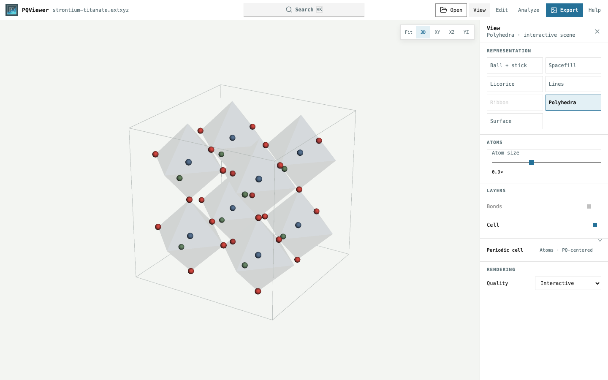

# Viewer guide

## Find a control

| Control | Use |
| --- | --- |
| **Open** | Load a file from your desktop |
| **View** | Representation, layers, atom size, and periodic display |
| **Edit** | Atom coordinates, elements, and cell |
| **Analyze** | Atom properties, measurements, and trajectory analysis |
| **Export** | Figure dimensions, format, and recipes |
| **Search** | Find atoms, settings, and commands |

On narrow screens, **Tools** opens the inspector sheet; its arrow expands it.
In short landscape windows, the inspector sits beside the canvas.

## Navigate and select

| Gesture | Action |
| --- | --- |
| Drag | Rotate |
| Secondary-drag or middle-drag | Pan |
| Scroll or pinch | Zoom |
| Click an atom | Select it and open its details |
| Shift-drag a box | Add a group of atoms |
| Click empty space | Clear selection |

**Fit**, **3D**, **XY**, **XZ**, and **YZ** sit above the canvas. Camera orientation
and selection stay stable while frames change. Box selection creates a group;
use an ordered selection for geometric measurements.

## Measure in order

1. Click the first atom.
2. With **Analyze** open, press `Shift+Tab` to focus the molecular canvas.
3. Use `↑` / `↓` to browse atoms, then `Enter` to add each atom in order.
   Pressing `Enter` on a selected atom removes it.
4. Choose **Plot** to follow the measurement through the trajectory, or **Pin**
   to keep it for recall.

| Ordered atoms | Measurement |
| --- | --- |
| 2 | Distance (Å) |
| 3 | Angle (°) |
| 4 | Dihedral (°) |

This synthetic water trajectory has the cell hidden. Periodic measurements use
the exact minimum image by default; switch to displayed images to measure a
chosen replica. Plot cursors follow the displayed frame; clicking a plot point
returns to that frame. See [trajectory analysis](trajectory-analysis.md) for
pair distributions, coordination, and normalization.

One selected atom shows its position and available charge, force, and velocity.
Groups show formula, centroid, extent, and unique-atom count. The selection bar
offers **Select** for element, molecule, residue, connected-component, or
distance-based groups, and **Track** for recent atom paths.

## Change the display

**View** offers the representations and layers supported by the source.
Unavailable representations explain their requirements on hover, focus, or
selection. **Periodic cell** contains wrapping, centering, and repeats;
**Rendering** controls interactive quality.

Coordination polyhedra depict visible bonding topology, using the nearest
distance shell when bonds are inferred. Planar shells become polygons;
transition-metal sites are preferred when several metal types are present.
Polyhedra protruding outside one displayed cell are omitted; dense structures
show a deterministic subset. This display is not a coordination-number analysis.

A single displayed cell omits minimum-image bonds through its boundary.
Repeats retain bonds between neighboring displayed cells. Display operations
preserve source coordinates; **Search → Source coordinates** shows stored
positions. See [cell and wrapping conventions](data-and-conventions.md#centered-periodic-cells)
for centred, low-rank, and vacuum cells.

The interactive view uses bundled 3Dmol; if initialization fails, it falls back
to the publication renderer. [Figure export](figures-and-recipes.md) uses a
separate renderer.

## Edit the structure

Open **Edit** or press `E`.

| Edit | Scope |
| --- | --- |
| Element identity | Whole structure |
| Cartesian coordinates | Displayed frame |
| Cell lengths/angles or 3 × 3 vectors | Cartesian positions stay fixed by default |
| **Keep fractional positions** | Scale atoms with the edited lattice |
| Periodic axes | Enable each axis separately |

For a molecule without a source cell, the editor suggests a centred
orthorhombic cell from its coordinate extent. Apply it explicitly to create a
cell. Changes are local and reversible. **Download current frame** writes
EXTXYZ with lattice and periodic-axis information.

## Follow a trajectory

The timeline provides stepping, playback, scrubbing, and the current frame.
Its menu holds playback settings, bookmarks, a reference frame, supplied scalar
plots, displacement vectors, and supported pair-distribution analysis.
**Track** displays the current atom positions and up to 50 previous frames.

Selections, pins, bookmarks, and references belong to the current workspace.
Opening another dataset resets them; reloading the browser also clears them.
Up to eight measurements, twelve bookmarks, and sixteen atom-image selections
can be tracked at once.

Measurement and scalar plots follow the current frame. Pair-distribution and
coordination plots aggregate frames; see [trajectory analysis](trajectory-analysis.md).

## Search and shortcuts

Press `Cmd/Ctrl+K` or `/` to search. Type, use `↑` / `↓`, then `Enter`.
Settings results show their location, open the inspector, and highlight the
control. Try `atom color`, `edit lattice vectors`, or `transparent image`.

| Keys | Action |
| --- | --- |
| `←` / `→` | Previous / next frame |
| `Shift+←` / `Shift+→` | Back / forward ten frames |
| `Space` | Play / pause |
| `R` | Fit structure |
| `1` / `2` / `3` / `4` | 3D / XY / XZ / YZ |
| `E` / `V` | Edit / View |
| `C` | Toggle cell |
| `?` | Full shortcut sheet and optional Vim navigation |

For exports, see [Figures and recipes](figures-and-recipes.md).
